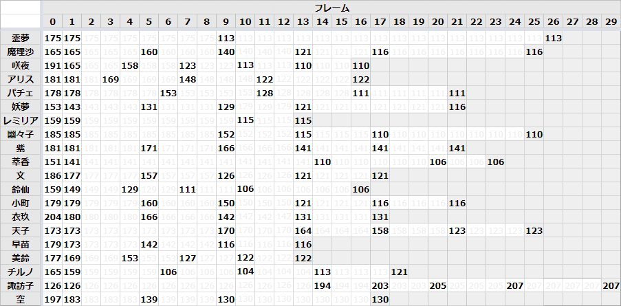

立ガ → 屈ガ移行
##################

移行フレームのキャラ差
-------------------------

.. .. csv-table::
..    :widths: auto
..    :stub-columns: 1
..    :header-rows: 1
.. 
..    キャラ,0,1,2,3,4,5,6,7,8,9,10,11,12,13,14,15,16,17,18,19,20,21,22,23,24,25,26,27,28,29
..    霊夢,175,,,,,,,,,113,,,,,,,,,,,,,,,,,,,,
..    魔理沙,165,,,,,160,,,,140,,121,,,,116,,,,,,,,,,,,
..    咲夜,191,165,,,158,,,123,,,113,,,110,,,,,,,,,,,,,,,
..    アリス,181,,,169,,,,148,,,,122,,,,,,,,,,,,,,,,,
..    パチェ,178,,,,,,153,,,,,128,,,,,111,,,,,,,,,,,,,
..    妖夢,153,143,,,,131,,,,129,,,,121,,,,,,,,116,,,,,,,,
..    レミリア,159,,,,,,,,,,115,,,,,,,,,,,,,,,,,,,
..    幽々子,185,,,,,,,,,152,,,,115,,,,110,,,,,,,,,,,,
..    紫,181,,,,,171,,,,166,,,,141,,,,,,,,,,,,,,,,
..    萃香,151,141,,,,,,,,,,,,,110,,,106,,,,,,,,,,,,
..    文,186,177,,,,157,,,,126,,,,121,,,,,,,,,,,,,,,,
..    鈴仙,159,149,,,129,,,111,,,106,,,,,,,,,,,,,,,,,,,
..    小町,179,,,,,160,,,,150,,,,121,,,,116,,,,,,,,,,,,
..    衣玖,204,180,,,,166,,,,142,,,,131,,,,,,,,,,,,,,,,
..    天子,173,,,,,,,,,170,,,,164,,,,158,,,,123,,,,,,,,
..    早苗,179,173,,,,142,,,,116,,,,,,,,,,,,,,,,,,,,
..    美鈴,177,169,,,153,,,127,,,122,,,,,,,,,,,,,,,,,,,
..    チルノ,165,159,,,,,106,,,,104,,,,113,,,,121,,,,,,,,,,,
..    諏訪子,126,,,,,,,,,,,,,,194,,,203,,,205,,,,207,,,,,
..    空,197,183,,,,139,,,,130,,,,,,,,,,,,,,,,,,,,

F式に関連する観察
------------------------

.. csv-table::
   :widths: 20, 20, 10, 20, 10, 20
   :stub-columns: 1
   :header-rows: 1

   キャラ,平均身長(1-5F),(順位),平均身長(1-10F),(順位),アリスF式猶予
   霊夢,175.0,12,163.7,13,6
   魔理沙,165.0,7,158.6,10,N/A
   咲夜,168.8,9,149.3,6,N/A
   アリス,176.2,13,164.6,14,4
   パチェ,178.0,14,166.6,15,3
   妖夢,145.0,3,137.0,4,N/A
   レミリア,159.0,5,155.0,9,N/A
   幽々子,185.0,19,179.0,20,6
   紫,181.0,17,174.6,19,6
   萃香,143.0,2,141.9,5,N/A
   文,178.8,15,161.3,12,2
   鈴仙,147.0,4,130.2,2,N/A
   小町,179.0,16,166.8,16,2
   衣玖,184.8,18,170.2,17,2
   天子,173.0,10,172.5,18,10
   早苗,174.2,11,151.9,8,2
   美鈴,167.4,8,149.6,7,1
   チルノ,160.2,6,135.3,3,N/A
   空,185.8,20,158.6,10,2
   (諏訪子),126.0,1,126.0,1,N/A

.. note::
   * 諏訪子は屈ガで身長が高くなるので除外
   * **F式猶予** は、アリスの上りJAが下りJA正ガ後に最速18Fで発生し、身長168dot以上なら当たると仮定した場合の推定値
